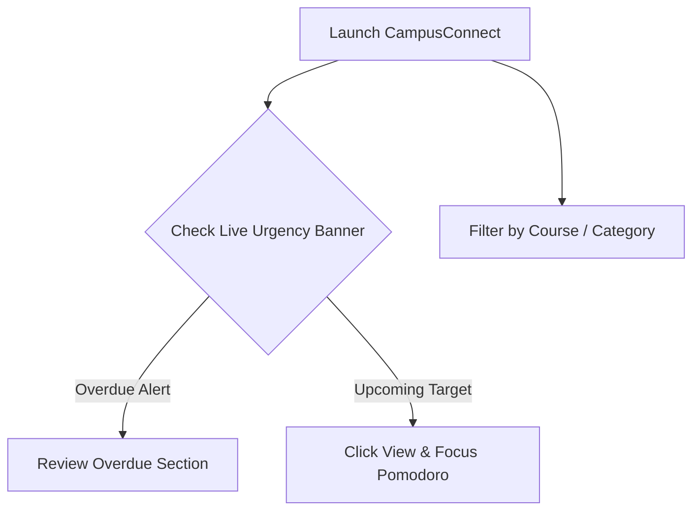

# Stage 2: User Flow - CampusConnect

## Overview
This document maps how students navigate and interact with **CampusConnect** to consolidate scattered deadlines and manage their academic schedule.

---

## User Journey Map

### Flow 1: Quick Onboarding & Dashboard Inspection
1. **Launch App**: Student opens CampusConnect web application.
2. **Instant Urgency Banner**: The live ticking countdown banner alerts the student to the nearest urgent deadline (e.g. *CS101 Mid-Semester Exam due in 4 hours*).
3. **Overview Metrics**: Stat summary cards show total count, overdue count, due today, due this week, and completion percentage.

### Flow 2: Un-scrambling WhatsApp Chat Announcements
1. **Copy Chat Message**: Student copies raw message text from class WhatsApp group or professor email.
2. **Open Un-scrambler**: Click **"Un-scrambler"** button in Navbar.
3. **Paste & Parse**: Paste raw text or click a sample preset.
4. **Auto Extraction**: Algorithm extracts course code (`CS101`), category (`Exam`), date (`Oct 27 11:59 PM`), and title.
5. **1-Click Import**: Select extracted items and click **"Import Selected Deadlines"**. Items are saved to student local storage immediately.

### Flow 3: Managing & Completing Deadlines
1. **Switch Views**: Choose between **Timeline List**, **Calendar Grid**, **By Subject**, or **Kanban Board**.
2. **Search / Filter**: Type keywords or filter by subject (`MATH202`) or category (`Lab Submissions`).
3. **Pomodoro Study Session**: Click the timer icon on any deadline to start a 25-minute deep-work focus session.
4. **Mark Complete**: Click checkbox; confetti burst confirms task completion and updates completion progress bar.

### Flow 4: Exporting to Personal Phone Calendar
1. Click **Export** icon in Navbar.
2. Click **"Export .ics"** to download iCalendar file.
3. Open downloaded `.ics` file to sync all deadlines with Google Calendar or Apple Calendar.
